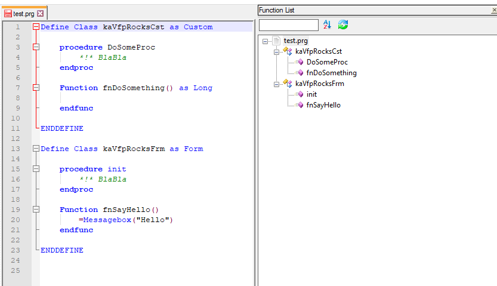

# VFP (Visual FoxPro) for Notepad++ (NP++ Version > v7.9.0)
## User Defined Language (userDefineLang.xml)
Description: text syntax highlighting.
##### Default (stylers.xml)-Theme
* Import the userDefineLang.xml as UDF into notepad++ under Language -> Define your language...

##### DarkModeDefault-Theme
* Import the userDefineLang_DarkModeDefault.xml as UDF into notepad++ under Language -> Define your language...

## FunctionList (vfp.xml + overrideMap.xml)
Description: display the classes and functions/procedures in Function List panel.

* first you must import the user defined language
* to use the Function List panel with VFP you must copy the vfp.xml and overrideMap.xml in your notepad++ directory on your userprofile.<br>Path: c:\users\username\appdata\roaming\notepad++\functionList\*.xml<br>
If the folder "functionList" not exists -> create it.

## Functionality
The vfp.xml will read the .prg file with regex to display Functions, Procedures and Classes. Every class has a anchor element on top with the name of class itself. That's a hack to display empty classes and to display the class type and source file in case of subclassing.

## Sample

```foxpro
Define Class kaVfpRocksCst as Custom of "C:\Dev\masterLibrary.prg"

	procedure DoSomeProc
		*!* BlaBla
	endproc

	Function fnDoSomething() as Long

	endfunc

ENDDEFINE

Define Class kaVfpRocksFrm as Form

	procedure init
		*!* BlaBla
	endproc

	Function fnSayHello()
		=Messagebox("Hello")
	endfunc

ENDDEFINE 

Define Class kaVfpRocksCstSub as "kaVfpRocksCst"


ENDDEFINE 
```

